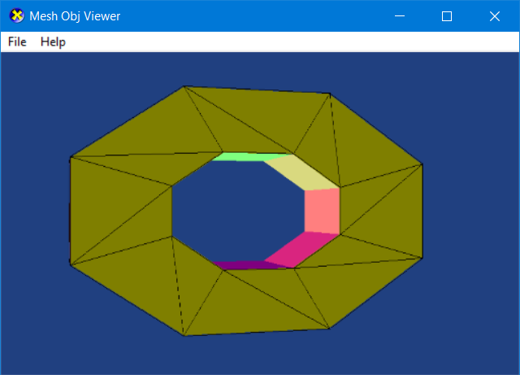

# MeshObjViewer

MeshObjViewer is a simple obj mesh file viewer for windows.
based on top of D3D9 and [tinyobjloader](https://github.com/syoyo/tinyobjloader). and it make a simple wrapper of tinyobjloader, to simplify further use.

## Snapshot

